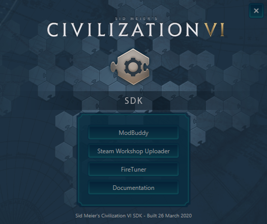
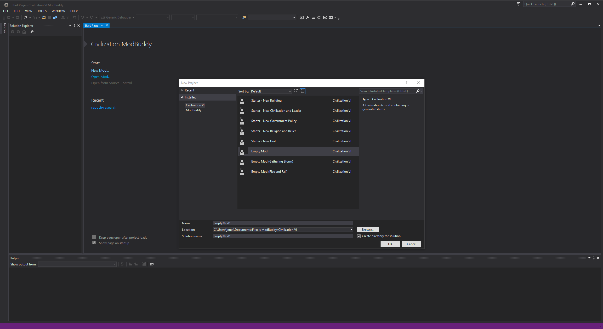
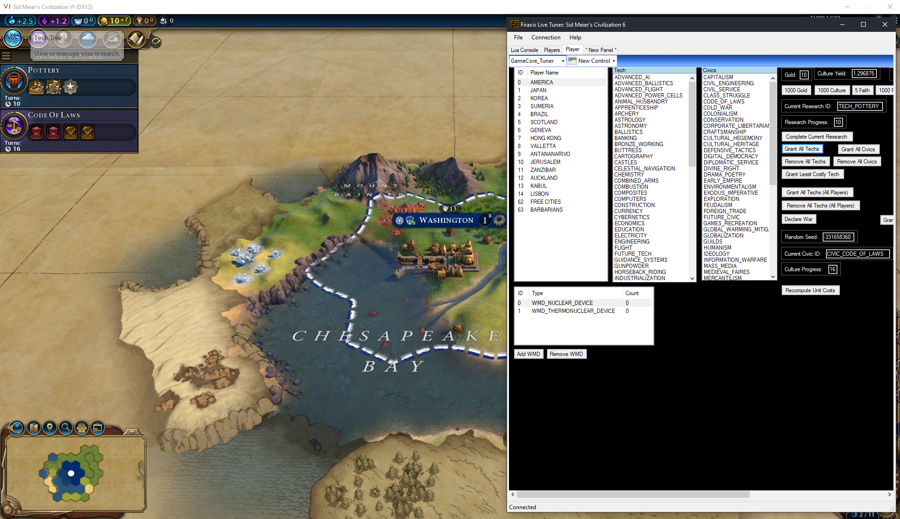

### ModBuddy
ModBuddy is an IDE powered by Visual Studio.

It gives us an environment and provides a useful set of tools to get up and running quickly with project blueprints.

### Steam Workshop Uploader

*TBC...*

### FireTuner
The FireTuner/LiveTuner is a companion application that we run alongside CIV VI. Which provides the following:
- **Lua console** where you can execute Lua code in the running game.
- **Panels** these panels are collections of views like tables, lists, drop downs, inputs etc that are backed by Lua code.

### Documentation

While the documentation is not strictly a tool, it is very interesting, it links to a static HTML page which contains documentation on the following topics

**Content Creation**
- Animation
- ArtDefFiles
- BuildingsProcess
- ColorKey
- DataDocumentation
- Geometry
- IconXML
- Iteration
- MappingToGameCore
- PackagingAssets
- ParticleEffects
- ParticleEffectsWorkflow
- TerrainBounceLighting
- TerrainOverview
- Texture
- TextureExportSettings
- The Life of a Leader
- TileBase
- UnitPreviewingScript
- World Builder

**FireFX**
- Emitter Properties
- FireFX UI Backend
- Understanding FireFX Scripts

**Forge UI**
- Debug Features
- Lua Conventions
- Lua Input
- Lua Reference
- Reference Guide

**Forge UI\Controls**
- AlphaAnim
- Bar
- Box
- BoxButton
- Button
- CheckBox
- Container
- Context
- DragPanel
- EditBox
- FlipAnim
- Grid
- GridButton
- Image
- Include
- Instance
- Label
- Line
- LuaContext
- MakeInstance
- Meter
- Movie
- PullDown
- RadioButton
- ScrollAnim
- ScrollPanel
- SimplePullDown
- SlideAnim
- Slider
- Stack
- TabControl
- TextButton
- TextureBar
- ToolTipType
- Tutorial

**Modding**
- 2D Leader Background Mods
- Add and Update Consumers in Mod Art File
- Add and Update Libraries in Mod Art File
- Adding New Screens
- Adding or Modifying Icons
- ColorKey Mods
- Cooking Art Files
- FireFX Built-In Functions
- Fog of War Overview
- FoW Hatch Texture Mods
- FoW Parchment Texture Mods
- FoW Sprite Texture Mods
- HallofFame_Backend
- HallofFame_Frontend
- HotLoading
- LoadOrder
- Modifying Existing Screens
- Notes shorthand
- SkyBox Overview
- SkyBox Texture Mods
- StrategicView Building Sprite Mods
- StrategicView Natural Wonder Sprite Mods
- StrategicView Overview
- Texture System Mods
- Understanding modinfo files
- Unit Mods
