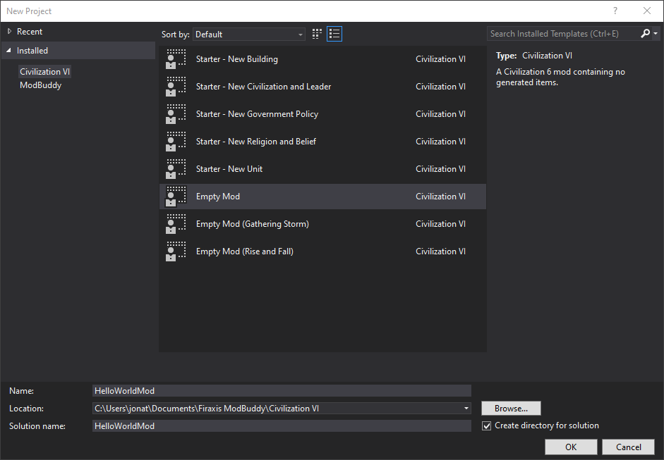
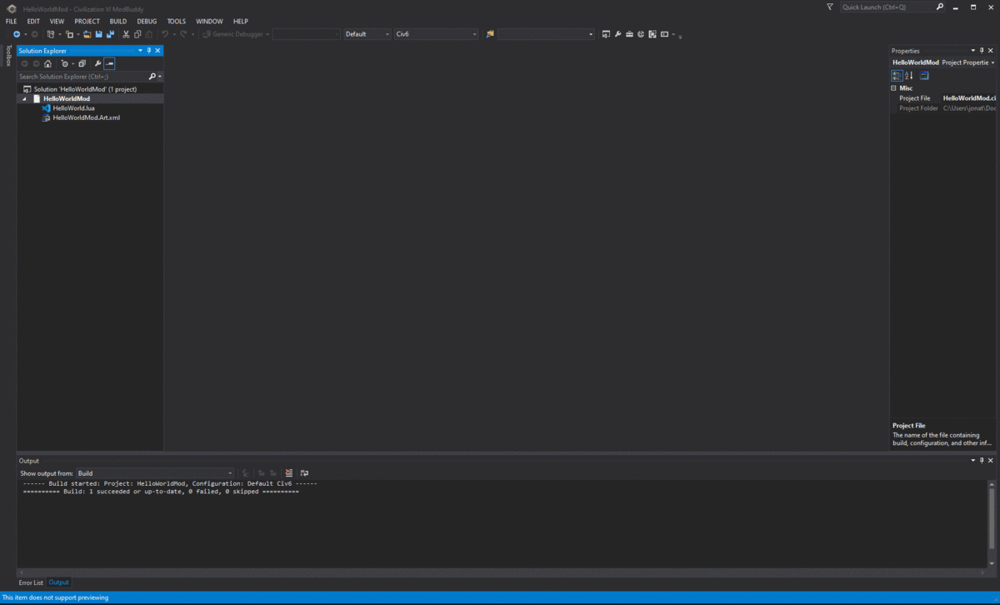
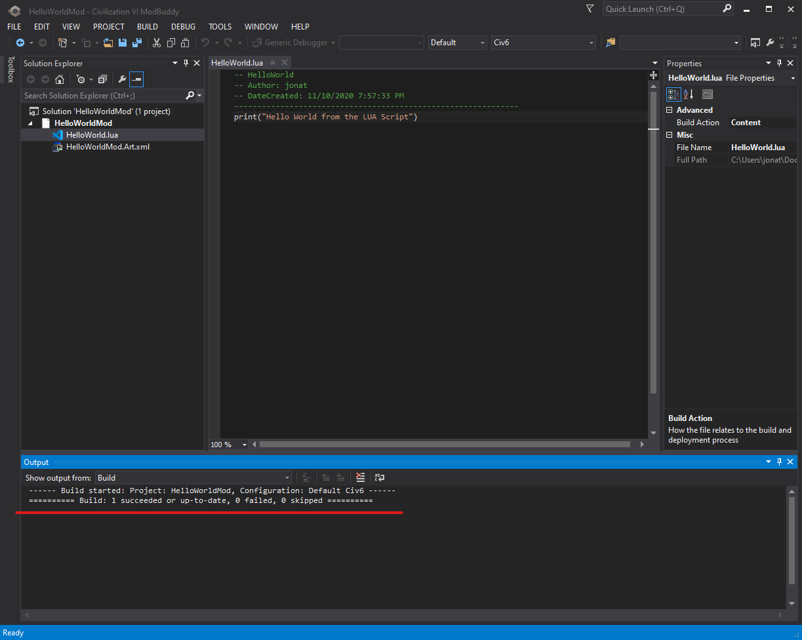

In this new Mod we are going to get familiar with the process of Executing Lua code from inside a mod.

We will first send the message `Hello World from the Lua console` to the logs, we will then create a new mod
and send the message `Hello World from the Lua Script` to the logs.

It's not groundbreaking but this marks the first time we are going to be able to execute Lua code from a mod and 
we will get familiar with how to view log output!

## Sending from the Console

If you have not already, follow the [setup guide](/docs/fire-tuner) and get the **FireTuner** running. 

Inside the **Lua Console** paste the following snippet
```Lua
print("Hello World from the Lua Console")
```

Open the **Lua.log** file from the following directory
```
%USERPROFILE%\Documents\My Games\Sid Meier's Civilization VI\Logs\Lua.log
```

Scroll to the bottom of the file, you should see that our print statement appeared, excellent.


:::note
Make a note of the log folder location, we will need this in the future!
:::

## Sending from a Mod
Now that we have managed to execute Lua code using the **FireTuner** we want take things up a notch.

We are going to use **ModBuddy** to create a new mod which prints `Hello World from the Lua script` to the game logs.

### Setup

Load up **ModBuddy** and create a new project, give it the name **HelloWorldMod** and create in your location of choice.



Fill in the next pages as desired as we won't be publishing our mod.

### Creating the Hello World Lua

Now with our new project open we need to add a new item, right click **HelloWorldMod** in the solution explorer and
select **add > New Item...** from the options choose **Lua Script** and call it `HelloWorld.Lua`

Inside the new file add the `print` statement, your file should look something like so

```Lua
-- HelloWorld
-- Author: jonat
-- DateCreated: 11/10/2020 7:57:33 PM
--------------------------------------------------------------
print("Hello World from the Lua Script")
``` 

### Registering Hello World Lua

Our next step is to register the script and when it should be called we do this inside **ModBuddy** and we have 2 options:
1. **FontEnd Actions** - Steps to be run during the setup phase of the game such as adding rulesets or a new map option
2. **In-Game Actions** - Mods run when the game is actually began

We are going to use the **In-Game Action**.

In **ModBuddy** right click on the mod under the solution and select **properties**, this is where can customize the contents of the `.MODINFO` file that is built

- Navigate to **In-Game Actions** 
- Select **Add Action**
- Select the new action and give it an **ID** of `HelloWorldAction` 
- Change the **type** to `AddGameplayScripts` (for now ignore the criteria etc)
- Expand the **files** option and **Add** a new file, choose the `HelloWorld.Lua` we created earlier (leave the priority blank)

Finally save the changes with `CTRL+S`, with that complete we are ready to build and deploy our mod into our game.



### Building the mod and installing

From within ModBuddy navigate to `BUILD > Build Solution` or hit `CTRL+SHIFT+B` this will both build and deploy the Mod
to `%USERPROFILE%\Documents\My Games\Sid Meier's Civilization VI\Mods`

:::tip
Ensure the build is successful to prevent any issues
:::



Open the built Mod in `%USERPROFILE%\Documents\My Games\Sid Meier's Civilization VI\Mods\HelloWorldMod`, open the `.MODINFO` file

:::caution
Note the `InGameActions` section, ensure it is present as this is what causes the script to run, it should look something like below, if its missing the mod wont work
:::

```xml
<?xml version="1.0" encoding="utf-8"?>
<Mod id="08cf90c9-a50b-42b9-a424-916def81f001" version="1">
  <Properties>
    <Name>Hello World Mod</Name>
    <Description>A Simple Hello World Modification to print Hello World to the game logs</Description>
    <Created>1605041890</Created>
    <Teaser>A Simple Hello World Modification to print Hello World to the game logs</Teaser>
    <Authors>Jonathan Turnock</Authors>
    <CompatibleVersions>1.2,2.0</CompatibleVersions>
  </Properties>
  <InGameActions>
    <AddGameplayScripts id="LoadHelloWorld">
      <File>HelloWorld.Lua</File>
    </AddGameplayScripts>
  </InGameActions>
  <Files>
    <File>HelloWorld.Lua</File>
  </Files>
</Mod>
```

### Finally...
Restart the game, with **FireTuner** open Select `Singleplayer > Play Now`, once the game is loaded we should see `Hello World from Lua Script` in the **FireTuner** Lua console and also in the `Lua.log`


:::note
The source code for this example is available in the [Github Repo](https://github.com/JonathanTurnock/civ-vi-modding/guides/hello-world-lua-mod). 

If you are encountering issues try cross-referencing the examples. 
:::
