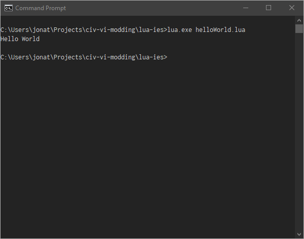
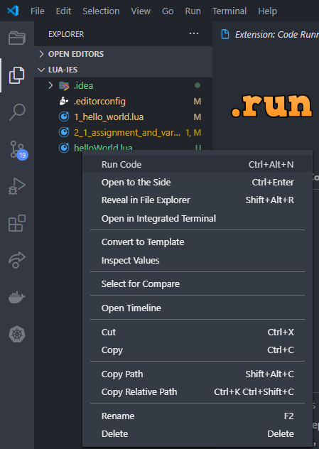
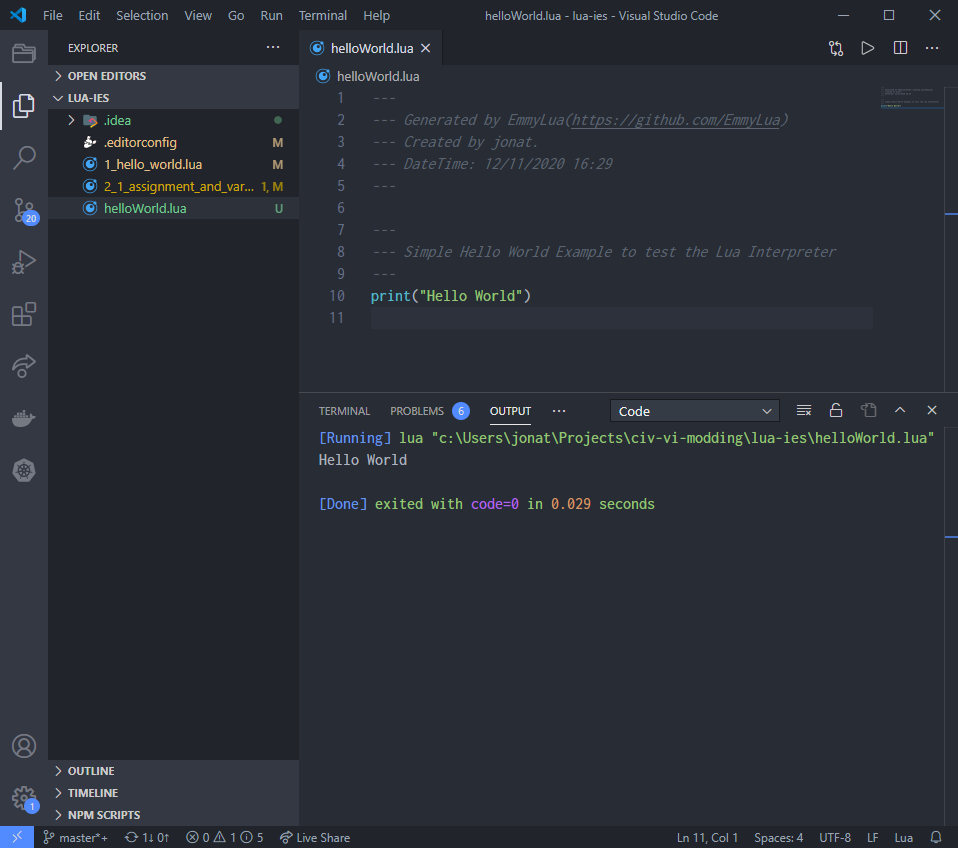

Before starting to write any Lua we need to have an environment where we can run it. Naturally
 Civ VI and many other games come with a Lua interpreter built in but working with them can be
  slow, especially if wanting to educate or try abstract concepts.

## Getting an Interpreter (Windows)

We are going to install a standalone Lua interpreter so that we can execute Lua locally on our
 machines in isolation.

Assuming we are on Windows head over to the GitHub repo and install `luaforwindows` this is a
> 'batteries included environment' for the Lua scripting language on Windows.

- [Homepage](https://github.com/rjpcomputing/luaforwindows)
- [Releases](https://github.com/rjpcomputing/luaforwindows/releases)

## Hello World

With our local Lua interpreter installed open up your editor of choice, I recommend Visual Studio
 Code with the Lua plugin installed:

```
Name: Lua
Id: sumneko.lua
Description: Lua Language Server coded by Lua
Version: 1.0.4
Publisher: sumneko
VS Marketplace Link: https://marketplace.visualstudio.com/items?itemName=sumneko.lua
```

Create a new file in your location of choice and call it `helloWorld.lua` and paste the following
```lua
---
--- Simple Hello World Example to test the Lua Interpreter
---
print("Hello World")
```

Now run the file by opening a Command Prompt window in the folder and typing
```shell script
lua.exe helloWorld.lua
```

We should see `Hello World` printed to the screen.



## Right Click Run

As we don't always want to open a command prompt window install the code runner plugin
 and restart VS Code
```
Name: Code Runner
Id: formulahendry.code-runner
Description: Run C, C++, Java, JS, PHP, Python, Perl, Ruby, Go, Lua, Groovy, PowerShell, CMD, BASH, F#, C#, VBScript, TypeScript, CoffeeScript, Scala, Swift, Julia, Crystal, OCaml, R, AppleScript, Elixir, VB.NET, Clojure, Haxe, Obj-C, Rust, Racket, Scheme, AutoHotkey, AutoIt, Kotlin, Dart, Pascal, Haskell, Nim,
Version: 0.11.1
Publisher: Jun Han
VS Marketplace Link: https://marketplace.visualstudio.com/items?itemName=formulahendry.code-runner
```

You should now be able to run lua files from the right click menu




## Next
We will dig into some core aspects of the language, again if anything is not making sense or not
 covered in enough detail try looking at the corresponding section in https://www.lua.org/pil/contents.html
