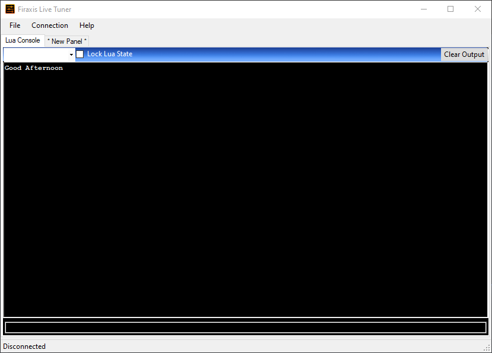
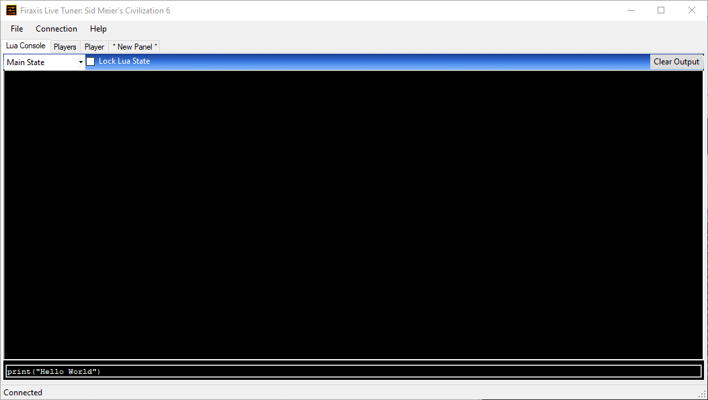
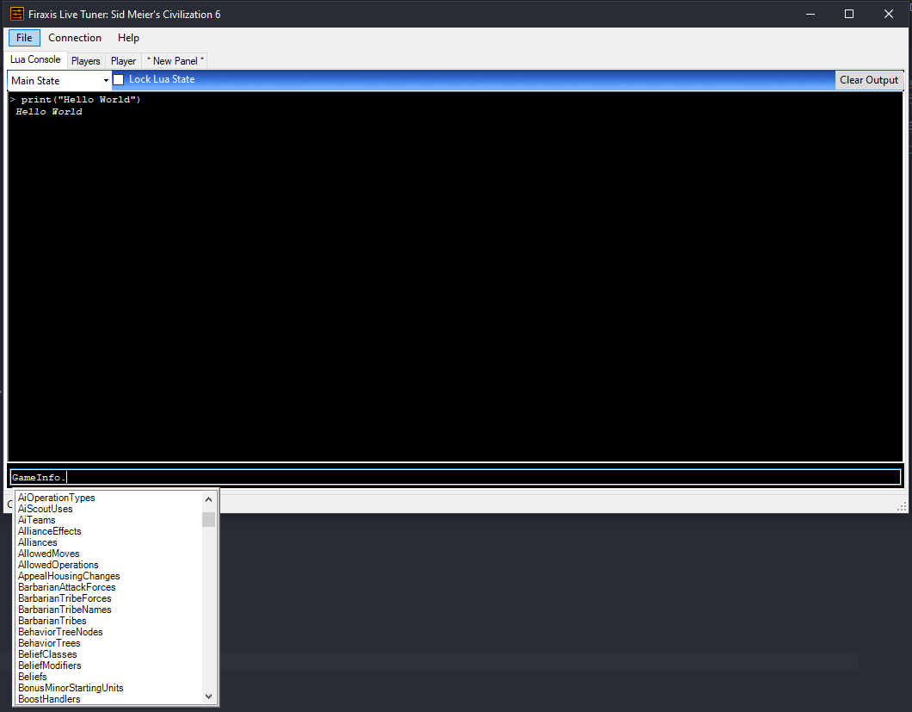
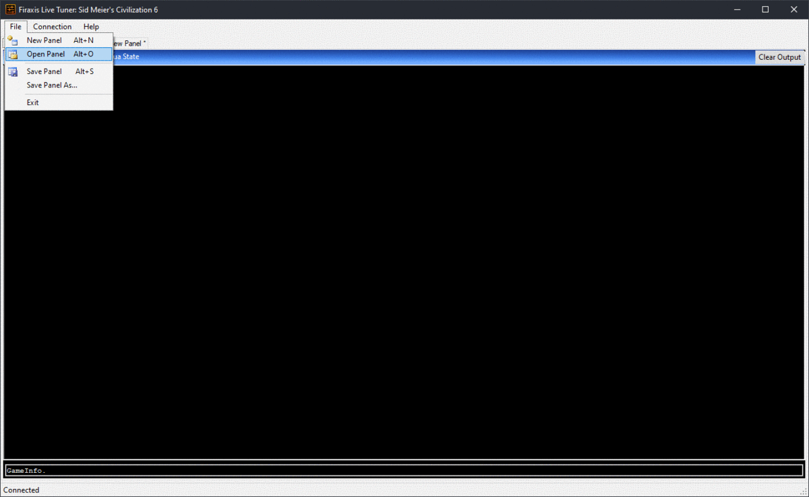

The **FireTuner** is a companion application that we run alongside CIV VI. Which provides the following:
- **Lua console** where you can execute Lua code in the running game.
- **Panels** these panels are collections of views like tables, lists, drop downs, inputs etc that are backed by Lua code.


## Setup

First step to get setup for live modding is to tweak some app options setting our CIV VI to windowed and allowing the **FireTuner** to connect.

Open `%USERPROFILE%\Documents\My Games\Sid Meier’s Civilization VI\AppOptions.txt` and set **FullScreen** to 0 (Windowed) and **EnableTuner** to 1 (Enabled)
```
...
;0 : windowed, 1 : fullscreen, 2 : windowed with no title bar
FullScreen 0
...
[Debug]
;Enable FireTuner.
EnableTuner 1
...
```

## Hello World!

To ensure our **FireTuner** is working launch the Development Tools and Start the FireTuner, we are greeted with a new window where the Tuner is not connected to the game.



Now start the game and click play now to run a new game, Once the game is up you will see **Connected** message in the lower left.

In the small input box you can now execute Lua code, let's try and print out "Hello World"!

Paste the following into the input and press enter.

```Lua
print("Hello World")
```



## Autocomplete

The Lua console comes bundled with an Autocomplete functionality, when inside the input box hit `TAB` to get suggestions 



## Pre-Built Debug Panels

The game comes pre-loaded with some useful debug panels that can be used as a first point of reference.

These debug panels can either be 
- Used to execute pre-built actions within the game
- Inspected to see how to execute actions

From inside the tuner window **File** menu select the **Open Panel** and navigate to you steam install folder. Under `Steam\steamapps\common\Sid Meier's Civilization VI\Debug` you will find a host of panels as `.ltp` files

### Inspecting for sample Lua

We can also use the existing panels as a mechanism to get handy Lua code snippets, it can be a great practice sandbox, spend time familirising with the code behind pre-built panels.

Simply right-click on any pre-built panel to see what Lua is required and re-assemble it in the Lua console.



